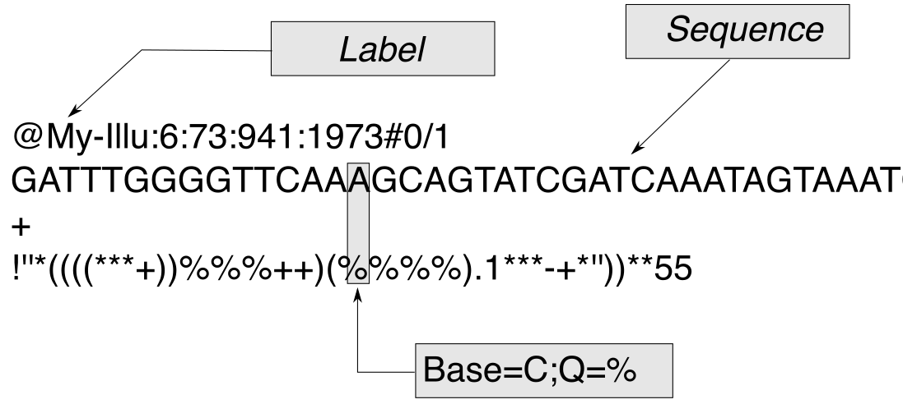

# FASTQ

    <strong>Ziele:</strong>
    <ol>
    <li>FASTQ verstehen</li>
    <li>Einfache Qualitätsbewertungsroutined in idiomatischem Rust programmieren.</li>
    <li>Grundlagen von GitHub vestehen und anwenden.</li>
    </ol>
    Wir beginnen mit einer Einführung in das FASTQ-Format. Falls das Format schon bekannt ist, kann die Einführung übersprungen werden.

FASTQ ist ein Dateiformat für den Austausch von Sequenzierungsdaten, das sowohl die Sequenz als auch eine entsprechende Bewertung der Basenqualität enthält.[^note] Sein Name leitet sich vom ehrwürdigen FASTA-Format ab, einem textbasierten Format zur Darstellung von DNA- und Aminosäuresequenzen, das ursprünglich 1985 zusammen mit einem Softwarepaket für das Alignment von Nukleinsäuren und Proteinen veröffentlicht wurde [Lipman et al. 1985](https://pubmed.ncbi.nlm.nih.gov/2983426/). Das FASTA-Format ist eines der in der Bioinformatik am weitesten verbreiteten Formate überhaupt. Die erste Zeile beginnt mit einem <code>></code> (Größer-als)-Symbol, direkt gefolgt von einem Namen oder einem eindeutigen Sequenzbezeichner, optional gefolgt von einer Beschreibung der Sequenz. Die folgenden Zeilen enthalten die Sequenz (in der Regel mit 70 oder 80 Zeichen pro Zeile). Eine Datei kann mehrere Sequenzeinträge enthalten, aber jeder muss mit einer <code>></code>-Zeile beginnen. Die FASTA-Datei für die Homo sapiens Fibrillin 1 (\textit{FBN1}) messenger RNA beginnt zum Beispiel so

<pre>
>NM_000138.4 Homo sapiens fibrillin 1 (FBN1), mRNA
AGTATTTCTCTCGCGAGAAACCGCTGCGCGGACGATACTTGAAGAGGTGGGGAAAGGAGGGGGCTGCGGG
AGCCGCGGCAGAGACTGTGGGTGCCACAAGCGGACAGGAGCCACAGCTGGGACAGCTGCGAGCGGAGCCG
AGCAGTGGCTGTAGCGGCCACGACTGGGAGCAGCCGCCGCCGCCTCCTCGGGAGTCGGAGCCGCCGCTTC
(weitere 165 Zeilen)
</pre>

Das FASTQ-Format ist eine Erweiterung des FASTA-Formats, in dem zusätzlich ein numerischer Qualitätswert für jedes Nukleotid in einer Sequenz gespeichert wird. Jeder Read in der Datei
wird durch vier Zeilen mit den folgenden Informationen dargestellt (ohne Längenbegrenzung):

<pre>
@SEQ_ID
GATTTGGGGTTCAAAGCAGTATCGATCAAATAGTAAATCCATTTGTTCAACTCACAGTTT
+
!''*((((***+))%%%++)(%%%%).1***-+*''))**55CCF>>>>>>CCCCCCC65 
</pre>

<figure>

 <figcaption>
	Bestandteile eines FASTQ-Files. 
  </figcaption>
</figure>

Die  <code>@</code>-Zeile umfasst ein freies Formatfeld, das in erster Linie für den Titel oder die Kennung der gemeldeten Sequenz verwendet wird. Illumina hat eine typische Namenskonvention für die Titelzeile, die wir weiter unten erläutern werden. Die zweite Zeile enthält die aufgerufenen Basen, d. h. die Sequenz des Read. Es folgt die <code>+</code>-Zeile Obwohl frühe Versionen des FASTQ-Formats in dieser Zeile eine Wiederholung der Titelzeile enthielten, ist es inzwischen Standard, dass die Zeile nur das Pluszeichen (<code>+</code>) enthält, was die Dateigröße erheblich reduziert. Die vierte Zeile schließlich enthält die ASCII-kodierten Phred-Qualitätsbewertungen und muss die gleiche Länge wie die Sequenzzeile haben. Somit wird für jede der in der zweiten Zeile angegebenen Basen eine Qualitätsbewertung in der entsprechenden Position der vierten Zeile angegeben.  In einigen früheren Versionen von FASTQ wurden verschiedene Schemata für die Kodierung von Qualitätswerten verwendet, aber die Gemeinschaft hat sich auf das Format Sanger/Illumina 1.8+ (Phred+33) geeinigt, das hier beschrieben wird.

[^note]:Texte von diesem und dem folgenden Kapitel wurden den entsprechenden Kapiteln in [Computational Exome and Genome Analysis](https://www.amazon.com/Computational-Exome-Genome-Analysis-Robinson/dp/0367657740) entnommen und leicht angepasst.
