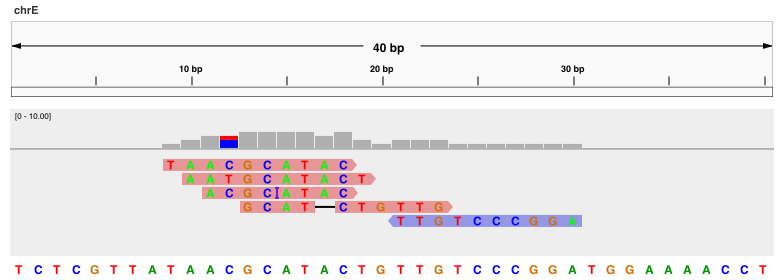
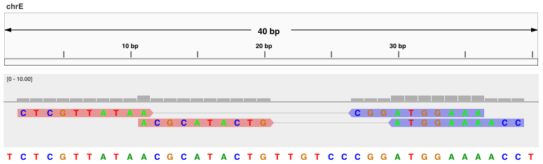

# SAM-Grundlagen

   
Wir werden das grundlegende SAM-Format anhand eines Beispiels erläutern, bei dem fünf Reads der Länge 10 auf eine Referenzsequenz der Länge 40 abgebildet werden (Abbildung 1).

   
Lesen Sie die Ausführungen zum SAM-Format und bearbeiten Sie die Übung am Ende der Seite.

 

<figure>
    
    
 <figcaption><strong>Abbildung 1</strong>
SAM-Datei (Minimalbeispiel). Oben: Alignment. Unten: Entsprechende SAM-Datei.</figcaption>
</figure>

SAM-Dateien bestehen aus einem optionalen Header-Abschnitt, gefolgt von einem Alignment-Abschnitt. Die Kopfzeilen beginnen mit `@'. Im Alignment-Abschnitt der SAM-Datei stellt jede Zeile ein Alignment für einen Read dar und umfasst mindestens 11 Pflichtfelder (Tabelle 1). 

<table>
  <caption><strong>SAM Format</strong>:Pflichtfelder</caption>
  <thead>
    <tr>
      <th>Col</th>
      <th>Feld</th>
      <th>Beschreibung</th>
      <th>Beispiel</th>
    </tr>
  </thead>
  <tbody>
    <tr>
      <td>1</td>
      <td><code>QNAME</code></td>
      <td>Query template NAME</td>
      <td><code>read_1</code></td>
    </tr>
    <tr>
      <td>2</td>
      <td><code>FLAG</code></td>
      <td>Bitweise Flag</td>
      <td><code>0</code></td>
    </tr>
    <tr>
      <td>3</td>
      <td><code>RNAME</code></td>
      <td>Name der Referenzsequenz</td>
      <td><code>chrE</code></td>
    </tr>
    <tr>
      <td>4</td>
      <td><code>POS</code></td>
      <td>Linke Kartierungsposition (1-basiert)</td>
      <td><code>11</code></td>
    </tr>
    <tr>
      <td>5</td>
      <td><code>MAPQ</code></td>
      <td>MAPping Qualität</td>
      <td><code>37</code></td>
    </tr>
    <tr>
      <td>6</td>
      <td><code>CIGAR</code></td>
      <td>CIGAR String</td>
      <td><code>10M</code></td>
    </tr>
    <tr>
      <td>7</td>
      <td><code>RNEXT</code></td>
      <td>Referenzname des Mate-Reads oder NEXT read</td>
      <td><code>*</code></td>
    </tr>
    <tr>
      <td>8</td>
      <td><code>PNEXT</code></td>
      <td>Position des Mate-Reads oder NEXT read</td>
      <td><code>0</code></td>
    </tr>
    <tr>
      <td>9</td>
      <td><code>TLEN</code></td>
      <td>Beobachtete Template-Länge (LENgth)</td>
      <td><code>0</code></td>
    </tr>
    <tr>
      <td>10</td>
      <td><code>SEQ</code></td>
      <td>Segment-SEQuenz</td>
      <td><code>ACGCATACTG</code></td>
    </tr>
    <tr>
      <td>11</td>
      <td><code>QUAL</code></td>
      <td>Basen-QUALitätsstring</td>
      <td><code>DIGAFHHBCA</code></td>
    </tr>
  </tbody>
</table>

Jede Zeile im Alignmentsabschnitt einer SAM-Datei umfasst 11 Pflichtfelder.

Das SAM/BAM-Format soll so allgemein wie möglich sein und verwendet das Wort 
<code>template</code> für DNA-Fragmente (englisch: fragments, inserts). 
Das SAM-Format verwendet das Wort 
<code>segment</code>, um sich auf eine zusammenhängende Sequenz oder 
Teilsequenz zu beziehen; zum Beispiel können die beiden Reads eines 
Lesepaares als zwei Segmente bezeichnet werden.  

Das Feld <code>QNAME</code> speichert den Namen der Abfrage-(query)-Sequenz, 
in der Regel ein Read.[^note]
POS gibt die Position auf dem Chromosom an, an der der Read 
ausgerichtet wurde. Das Feld <code>FLAG</code> wird weiter unten erklärt.

Das Feld <code>MAPQ</code> stellt die 
Mappingqualität, die vom Aligner zugewiesen wurde, und spiegelt das Vertrauen 
wider, mit dem der Read  auf die angegebene Position abgebildet werden konnte. 
Die CIGAR-Zeichenkette bietet eine kompakte 
kompakte Darstellung des Alignments, die im Folgenden erläutert wird. 

Die Felder <code>RNEXT</code>, 
<code>PNEXT</code> und <code>TLEN</code> werden nur für Paired-End-Reads verwendet. 
Daher wird bei Single-End 
Reads <code>RNEXT</code> auf ``*'' (für <i>not-applicable</i>)  gesetzt.
<code>PNEXT</code> und  <code>TLEN</code> werden auf 0 gesetzt. Schließlich enthält 
das Feld <code>SEQ</code> die Nukleotidsequenz des Reads und das Feld <code>QUAL</code> 
zeigt die Basenqualitätswerte für jede Position an.

[^note]: Segmente mit demselben <code>QNAME</code> stammen von der gleichen Vorlage, 
d. h. Reads eines Read-Paares haben normalerweise den gleichen 
<code>QNAME</code>. 

## Paired-End-Sequenzen

 In Abbildung 2 werden zwei Paare 
bestehend aus vier Reads der Länge 10 werden auf eine Referenzsequenz der Länge 40 abgebildet. Beachten Sie, dass 
Mitglieder desselben Paars haben denselben <code>QNAME</code> und werden auf verschiedene Stränge abgebildet. Read 1 wird dem 
dem Vorwärtsstrang an Position 2 zugeordnet und bildet ein Paar mit dem Read, der dem Rückwärtsstrang an Position 
Strang an Position 27 zugeordnet ist. <code>RNEXT</code> wird auf <code>=</code> gesetzt, da der zweite Read des Paares 
des Paares auf dieselbe Referenz, d. h. <code>chrE</code>, abgebildet wird, und <code>PNEXT</code> wird auf 27 gesetzt, weil der 
Reverse-Read auf diese Position abgebildet wird (der Reverse-Read ist an den Positionen 27-36 ausgerichtet). 
Daher wird <code>TLEN</code> auf 35 gesetzt, denn dies ist der Abstand zwischen der äußersten linken und der äußersten rechten 
der am weitesten rechts gelegenen Base der beiden Reads. Der Eintrag <code>TLEN</code> für den Reverse-Read wird mit 
einem Minuszeichen dargestellt.

<figure>
    
    
 <figcaption><strong>Abbildung 2</strong>
SAM-Datei (Minimalbeispiel, Paired-End-Sequenzen). Oben: Alignment. Unten: Entsprechende SAM-Datei.</figcaption>
</figure>

Für Paired-End-Reads werden andere bitweise Flags verwendet als für Single-End-Reads. Die Flags <code>99</code> und <code>147</code> zeigen an, dass beide Mitglieder des Paares korrekt auf den Vorwärts- und den Rückwärtsstrang gemappt wurden.

