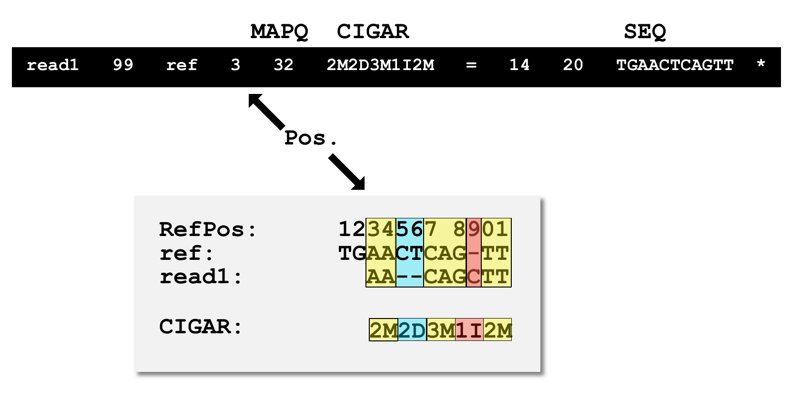

# CIGAR

Eine CIGAR (Concise Idiosyncratic Gapped Alignment Report) String besteht aus einer Reihe von 
Operationslängen sowie den Operationen, die beschreiben, wie genau ein Read an die Referenzsequenz angeglichen wurde (Abbildung 1). 

<figure>

 <figcaption><strong>Figure 1</strong>
Der senkrechte Strich stellt ein Alignment von read1 beginnend an Position 3 der Referenz (<i>ref</i>) dar. Das Alignment besteht aus zwei übereinstimmenden Nukleotiden, gefolgt von einer Deletion von 2 Nukleotiden, drei übereinstimmenden Nukleotiden und einer Insertion von einem Nukleotid und zwei übereinstimmenden Nukleotiden. </figcaption>
</figure>

Die drei wichtigsten CIGAR-Operationen sind <b>M</b> (Match/Mismatch), <b>I</b> (Insertion) und <b>D</b> (Deletion), aber
aber es gibt noch sechs weitere Operationen, von denen einige im Folgenden erläutert werden. Alle CIGAR 
Operationen sind in Tabelle 1 zusammengefasst. Eine CIGAR-Zeichenkette kann man sich als eine Reihe 
von Operationslängen plus die CIGAR-Operation, die eine abstrakte und kompakte Darstellung 
beliebiger Ausrichtungen ermöglicht. Betrachten Sie beispielsweise das folgende Alignment, in dem die Abfragesequenz 
(Q) an die Referenzsequenz (R) angeglichen wird, beginnend an Position 7 der Referenzsequenz.

<pre>
AGCATGTTAGATAA--GATAGCTGG R
      || ||||| |||| ||||
------TTGGATAAAGGATA-CTGG Q
</pre>

Es gibt 8 anfängliche Übereinstimmungen, dann eine Einfügung 
von 2 Nukleotiden in die Abfrage, dann vier weitere Übereinstimmungen, 
dann eine Löschung von einer Base in der Abfrage und dann vier weitere 
Übereinstimmungen. Wir können dies als <code>8M2I4M1D4M</code> darstellen. 

Man beachte, dass die dritte Base der Abfragesequenz (G) sich tatsächlich von der Base 
der Referenzsequenz (A) unterscheidet, an die sie angeglichen wurde. Nichtsdestotrotz 
handelt es sich um eine "Alignment match" (Ausrichtungsübereinstimmung)
 (M), obwohl es keine  Sequenzübereinstimmung ist. 

<table>
  <caption>CIGAR operations</caption>
  <thead>
    <tr>
      <th>Operation (Op)</th>
      <th>Beschreibung</th>
    </tr>
  </thead>
  <tbody>
    <tr>
      <td><tt>M</tt></td>
      <td><i>Match</i> (Sequenzübereinstimmung oder Fehlübereinstimmung, keiner Insertion oder Deletion)</td>
    </tr>
    <tr>
      <td><tt>I</tt></td>
      <td>Insertion (zusätzliche Nicht-Referenzbase)</td>
    </tr>
    <tr>
      <td><tt>D</tt></td>
      <td>Deletion (Referenzbase fehlt in der Lesung)</td>
    </tr>
    <tr>
      <td><tt>N</tt></td>
      <td>skipped region=übersprungener Bereich aus der Referenz</td>
    </tr>
    <tr>
      <td><tt>S</tt></td>
      <td>soft clipping (geclippte Sequenzen noch in SEQ vorhanden)</td>
    </tr>
    <tr>
      <td><tt>H</tt></td>
      <td>hartes Clipping (geclippte Sequenzen nicht in SEQ vorhanden)</td>
    </tr>
    <tr>
      <td><tt>P</tt></td>
      <td>padding (stille Löschung aus gepolsterter Referenz)</td>
    </tr>
    <tr>
      <td><tt>=</tt></td>
      <td>sequence match: Sequenzübereinstimmung</td>
    </tr>
    <tr>
      <td><tt>X</tt></td>
      <td>sequence mismatch=Sequenz-Fehlanpassung</td>
    </tr>
  </tbody>
 
</table>

### Übung 1

Nehmen Sie eine Referenz- und eine Querysequenz sowie den CIGAR-String, der das Alignment spezifiziert (z.B. von Abb. 1). In unserem Beispiel wären die drei Argumente also
- Query (read_4): GCATCTGTTG
- Ref: GCATACTGTTG
- CIGAR: 4M1D6M

Das Ziel ist es, eine Funktion zu schreiben, welche das entsprechende Alignment ausgibt, also in unserem Beispiel
<pre>
GCAT-CTGTTG
|||| ||||||
GCATACTGTTG
</pre>

# Übung 2

Probieren Sie Ihre Funktion mit "realistischen" BAM-Dateien -- wir haben eine TODO -- "kleine" BAM-Datei erstellen.

