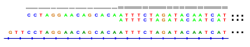

# Clipped Reads

Wichtige Mapping-Tools wie [BWA](https://github.com/lh3/bwa)  versuchen, einen Teil eines Reads zu kartieren, wenn sie den Read nicht in voller Länge auf das Referenzgenom abbilden können. In diesen Fällen kann der nicht zuzuordnende Teil durch einen Prozess namens <emph>Clipping</emph> aus dem Alignment ausgeschlossen werden. 

Mit soft-clipping, das in der CIGAR-Zeichenkette mit einem <code>>S</code> angezeigt wird, werden die abgeschnittenen Sequenzbasen nicht aus der SEQ-Zeichenkette entfernt, aber nicht von Varianten-Callern verwendet und nicht in Viewern wie IGV ([Integrativer Genomik-Viewer](https://igv.org/))angezeigt. 

Das Hard-Clipping (H) ähnelt dem Soft-Clipping (S), unterscheidet sich aber dadurch, 
dass die hart geclippte Teilsequenz nicht im Alignment-Datensatz enthalten ist 
(Abbildung 1).[^note]

<figure>

 <figcaption><strong>Figure 1</strong>
 Ein IGV-Screenshot des 5'-Endes eines Alignments von zwei Reads zur Referenz. Der zweite Read wurde soft-clipped; er wurde mit REF=chr4, POS=16034528 und einem CIGAR von 14S87M ausgerichtet. Die ersten 14 Nukleotide wurden also „soft-clipped“. Sie wurden in der SAM-Datei nicht aus der Sequenz entfernt, werden aber in IGV nicht angezeigt.
</figcaption>
</figure>

<pre>
Ref:   GTTCCTAGGAACAGCACAATTTCTAGATACAATCAT
Read1:    CCTAGGAACAGCACAATTTCTAGATACAATCAT
Read2:     ggtcacatgattgtATTTCTAGATACAATCAT
</pre>

Das entsprechende Alignment von Read1 und Read2 mit Ref. Die soft-clipped (nicht ausrichtbaren) Basen von Read2 sind in Kleinbuchstaben dargestellt.

[^note]:BWA verwendet das Soft-Clipping für das primäre Alignment, damit die ursprünglichen Rohdaten bei Bedarf aus der BAM-Datei regeneriert werden können. Für die sekundären Alignments ist dies nicht notwendig, daher verwendet BWA Hard Clipping, um Speicherplatz zu sparen.