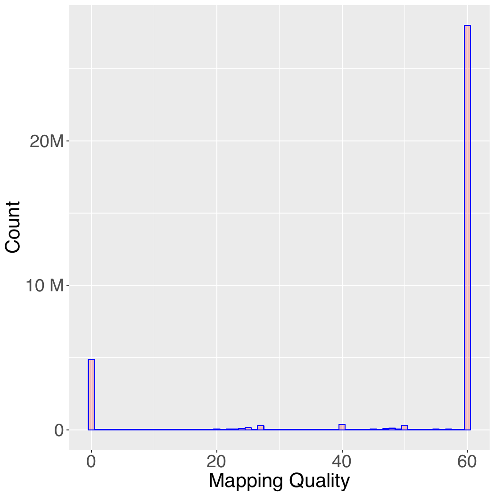

# Mapping-Qualität

Das fünfte Feld einer SAM-Datei gibt die Mapping-Qualität des Read an. Der MAPQ-Wert (MAPping Quality) spiegelt die Wahrscheinlichkeit wider, dass
der Read an der falschen Position im Genom ausgerichtet ist. Wie der Wert für die Basenqualität handelt es sich dabei um eine Phred-skalierte posteriore Wahrscheinlichkeit, dass die vom Aligner angegebene Mapping-Position falsch ist

\\[ 
    MAPQ = -10\log_{10} P(\mathrm{mapping position wrong) 
\\]

Die MAPQ wird auf die nächste ganze Zahl gerundet. Beispielsweise würde einer von tausend Reads mit einem MAPQ von 30 als falsch ausgerichtet vorhergesagt.  Ein MAPQ-Wert von 255 bedeutet, dass die Zuordnungsqualität nicht verfügbar ist.

Eine der größten Herausforderungen für Read-Alignment-Algorithmen ist das 
Vorhandensein von sich wiederholenden Sequenzen im menschlichen Genom (repeats), 
so dass ein kurzer Read an zwei oder mehr Positionen gleich gut ausgerichtet sein 
kann. In diesem Fall weist BWA dem Read eine MAPQ von Null zu und wählt eine der Positionen nach dem Zufallsprinzip aus. 

<figure>

 <figcaption><strong>Figure 1</strong>
 Verteilung der MAPQ-Werte (Mapping-Qualität) für ausgerichtete Reads aus dem Exom von NA12878.
 BWA-MEM ordnete in diesem Beispiel den meisten Reads einen Mapping-Quality-Score von 60 zu, wobei der zweithäufigste Score Null war, und es ordnete einer viel geringeren Anzahl von Reads Zwischen-Scores zu. 
</figcaption>
</figure>

Man sollte sich der Tatsache bewusst sein, dass verschiedene Aligner unterschiedliche Methoden zur Berechnung der Mapping-Qualität verwenden und die von verschiedenen Alignern erzielten MAPQ-Scores im Allgemeinen nicht direkt vergleichbar sind.

# Übung 1

Berechnen Sie die durchschnittliche Mapping-Qualität aller Reads in einer BAM-Datei. Berechnen Sie den Anteil der Reads mit einer Mindestqualität von Q30.
