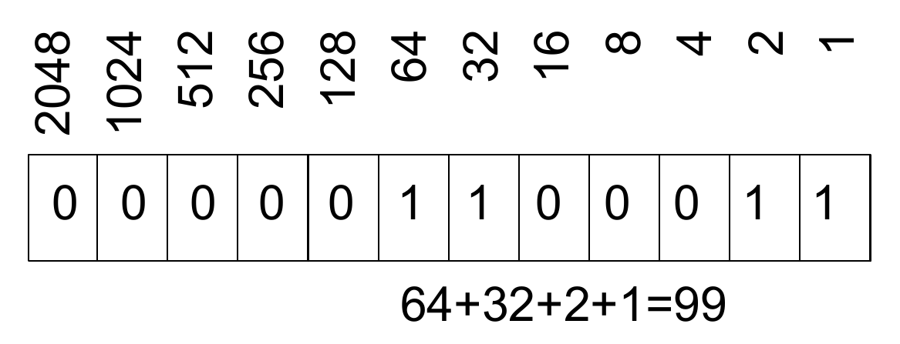

# Das SAM-Bitflag

Das zweite Feld jedes Datensatzes in einer SAM-Datei stellt ein Bitfeld mit Werten aus 12 Bitflags~(Tabelle 1) dar.

Das SAM-Format verwendet 12 Bitflags, von denen jedes den Wert 1 (Ja, Wahr) oder 0 (Nein, Falsch) haben kann. Die Bitflags können unabhängig voneinander kombiniert werden und werden in SAM-Dateien als entsprechender dezimaler Ganzzahlwert angezeigt.

<table>
  <caption>Tabelle 1: SAM-Format und Bitflags</caption>
  <thead>
    <tr>
      <th>Bit (hex)</th>
      <th>Bit (dez)</th>
      <th>Beschreibung</th>
    </tr>
  </thead>
  <tbody>
    <tr>
      <td>0x1</td>
      <td>1</td>
      <td>Template hat mehrere Segmente (mehrere Reads, 
      normalerweise ein Readpaar)  Template has multiple segments (multiple reads, usually a read pair)</td>
    </tr>
    <tr>
      <td>0x2</td>
      <td>2</td>
      <td>Jedes Segment der Vorlage ist gemäß dem Aligner richtig ausgerichtet (Each segment of the template is properly aligned according to the aligner)</td>
    </tr>
    <tr>
      <td>0x4</td>
      <td>4</td>
      <td>Segment ist nicht zugeordnet (Segment is unmapped)</td>
    </tr>
    <tr>
      <td>0x8</td>
      <td>8</td>
      <td>Nächstes Segment in der Vorlage ist nicht zugeordnet (Next segment in the template is unmapped)</td>
    </tr>
    <tr>
      <td>0x10</td>
      <td>16</td>
      <td>SEQ ist reverse komplementär (SEQ is reverse complemented)</td>
    </tr>
    <tr>
      <td>0x20</td>
      <td>32</td>
      <td>SEQ des nächsten Segments in der Vorlage ist revers komplementär (SEQ of the next segment in the template is reverse complemented</td>
    </tr>
    <tr>
      <td>0x40</td>
      <td>64</td>
      <td>Erstes Segment in der Vorlage (First segment in the template)</td>
    </tr>
    <tr>
      <td>0x80</td>
      <td>128</td>
      <td>Letztes Segment in der Vorlage (Last segment in the template)</td>
    </tr>
    <tr>
      <td>0x100</td>
      <td>256</td>
      <td>Sekundärausrichtung (Secondary alignment)</td>
    </tr>
    <tr>
      <td>0x200</td>
      <td>512</td>
      <td>Segment besteht die Qualitätskontrollen nicht (Segment does not pass quality controls)</td>
    </tr>
    <tr>
      <td>0x400</td>
      <td>1024</td>
      <td>Segment ist eine PCR oder ein optisches Duplikat (Segment is a PCR or optical duplicate)</td>
    </tr>
    <tr>
      <td>0x800</td>
      <td>2048</td>
      <td>Supplementäre Ausrichtung (Supplementary alignment)</td>
    </tr>
  </tbody>
</table>

Ein Bitfeld wird verwendet, um eine Reihe boolescher Werte (Ja/Nein) kompakt zu speichern. In unserem Fall möchten wir 12 Ja/Nein-Attribute zu jedem Lesevorgang speichern. Theoretisch könnten wir zwölf separate char-Werte (jeweils ein Byte) speichern, aber wenn wir beachten, dass die 12 Werte als einzelne Bits eines Bitfelds gespeichert werden können, können wir eine erhebliche Menge an Speicherplatz einsparen. Tabelle 1 zeigt die zwölf Bitflags und Abb. 1 zeigt ein Beispiel dafür, wie die Bitflags als dezimale Ganzzahlwerte dargestellt werden. 

<figure>

 <figcaption><strong>Figure 1</strong>
Um zu verstehen, wie die Bitfelder dargestellt werden, ist es hilfreich, sich an die Position zu erinnern  Die Notation von Zahlen funktioniert. 
In der bekannten Dezimalschreibweise steht die Zahl 453 für \\(4\times 10^2 +  5\times 10^1+3\times10^0= 400 + 50 + 3 = 453\\). 
In binärer Schreibweise steht eine Zahl wie 101101 für 
\\(1\times 2^5+0\times 2^4+1\times2^3+1\times 2^2+0\times 1^1+1\times 2^0 = 32 + 8+4+1= 45\\).  
</figcaption>
</figure>

Oft ist es zweckmäßig, die hexadezimale Schreibweise („hex“) zu verwenden, bei der die Basis nicht 10 oder 2, sondern 16 ist; Die 
Ziffern werden durch 0–9 dargestellt, gefolgt von A, B, C, D, E und F. Um mit SAM-Dateien völlig vertraut zu sein 
und wenn Sie Programme wie SAMtools verwenden, um damit zu arbeiten, ist es hilfreich zu verstehen, wie man konvertiert 
zwischen diesen drei Zahlendarstellungen.

Ein Wert von 99 zeigt zum Beispiel folgende Ergebnisse an:

- der Read mehrere Segmente in der Sequenzierung hat,[^note0] d.h.,  0x1= \\(1\times 16^0=1\\)
- jedes Segment des Reads konnte richtig gemappt werden (korrektes Mapping beider Reads des Read-Paares), d.h.,  0x2=\\(2 \times 16^0=2\\) 
- der Mate-Read auf den Rückwärtsstrang gemappt ist, d.h., 0x20=\\(2\times16^1=32\|))
- der Read, auf den im aktuellen SAM-Datensatz Bezug genommen wird, ist das erste Segment im Tempalte  (der erste Read im  dem Paar, d.h.,  0x40=\\(4\times 16^1=64\\)) 

Um zu verstehen, wie die Bitfelder dargestellt werden, ist es hilfreich, sich an die Position zu erinnern  Die Notation von Zahlen funktioniert. 
In der bekannten Dezimalschreibweise steht die Zahl 453 für \\(4\times 10^2 +  5\times 10^1+3\times10^0= 400 + 50 + 3 = 453\\). 
In binärer Schreibweise steht eine Zahl wie 101101 für 
\\(1\times 2^5+0\times 2^4+1\times2^3+1\times 2^2+0\times 1^1+1\times 2^0 = 32 + 8+4+1= 45\\) - vgl. hierzu Abbildung 1 und Tabelle 1.  

<figure>

 <figcaption><strong>Abbildung 1</strong>

</figcaption>
</figure>

Bit-Operationen können verwendet werden, um Lesevorgänge in einer SAM-Datei zu filtern. Das SAM-Format verlangt zum Beispiel, dass für jeden Lesevorgang eine und nur eine der zugehörigen Zeilen folgende Bedingungen erfüllt 

<pre>
FLAG & 0x900 == 0
</pre>

Diese Zeile wird als <tt>primäre Zeile</tt> (primary line) des Reads bezeichnet. Der hexadezimale Wert 0x900 ist gleich 0x800 plus 0x100, was bedeutet, dass die Bit-Flags für das supplementäre Alignment (0x800) und das sekundäre Alignment (0x100) gesetzt sind. Erinnern Sie sich, dass <code>&</code> für die bitweise logische UND-Verknüpfung eines Bitpaares steht. Wenn beide Bits 1 sind, ist das Ergebnis der Operation 1, ansonsten 0. Zum Beispiel 

<pre>
      1010       
AND   1100       
     =1000      
</pre>

Wenn also ein Read entweder als  sekundäres Alignment[^note]
oder ein \index{supplementary alignment} supplementary alignment,\footnote{Nach der SAM-Spezifikation ist ein chimäres Alignment ein Alignment eines Reads, das nicht als lineares Alignment dargestellt werden kann. In der Regel bedeutet dies, dass ein Read aus mehreren Segmenten besteht, die sich an verschiedenen Teilen des Genoms ausrichten. Die Segmente haben keine großen Überlappungen. Eines der Segmente wird als das repräsentative Alignment betrachtet, die anderen werden als ergänzend bezeichnet und haben das Flag für ergänzendes Alignment gesetzt.
dann erhalten wir <code>FLAG \& 0x900 != 0</code>.[^note2] Das SAM-Format besagt, dass eine beliebige Anzahl von Zeilen sekundäre oder ergänzende Ausrichtungen darstellen kann, aber dass nur eine Zeile die primäre (repräsentative) Ausrichtung sein kann.

[^note0]: normalerweise bezieht sich dies auf einen Paired-End- oder Mate-Pair-Read
[^note]: Wenn ein Read aufgrund von repetitiven Sequenzen oder aus anderen Gründen auf mehrere Stellen abgebildet wird, wird eine dieser Ausrichtungen als primär markiert, und bei allen anderen wird das Bitflag für sekundäres Alignment gesetzt. 
[^note2]:Das Ergebnis könnte 0x100, 0x800 oder 0x900 sein. 
